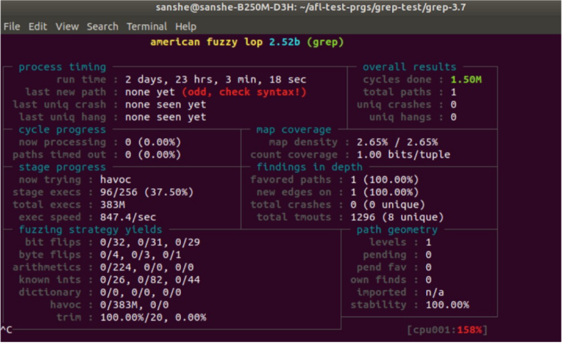
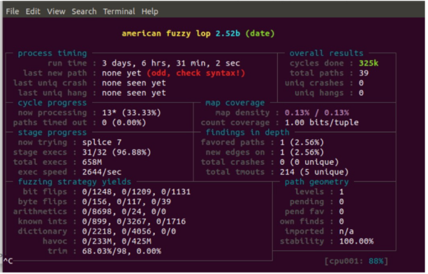

<details markdown='1'>

<summary>Contents</summary>

1. [Fuzz Test on Binutils-gdb](#binutils)

2. [Fuzz Test on Nginx](#nginx)

3. [Fuzz Test on Imagemagick](#imagick)

4. [Fuzz Test on Libressl/ Openssl](#libressl)

5. [Fuzz Test on Grep](#grep)

6. [Fuzz Test on Coreutils](#cutils)

</details>

<a name="binutils"></a>
## 1. Fuzz Test on Binutils-gdb
## Source Repo
https://github.com/bminor/binutils-gdb

binutils-gdb : latest commit

```sh
git log  -1 --format=%cd
Tue Nov 23 00:00:08 2021 +0000
san-B250M-D3H:~/binutils-gdb$ git log
commit 4d3af74a388191e3363d104e6702acfd96dc5e60 (HEAD -> master, origin/master, origin/HEAD)
Author: GDB Administrator <gdbadmin@sourceware.org>
Date:   Tue Nov 23 00:00:08 2021 +0000
Automatic date update in version.in
commit c272a98cbf596ddf1a70a41801c6e86d9564d152
Author: Simon Marchi <simon.marchi@efficios.com>
Date:   Mon Nov 22 11:27:31 2021 -0500
gdb: pass more const target_waitstatus by reference
While working on target_waitstatus changes, I noticed a few places where const target_waitstatus objects could be passed by reference instead of by pointers. And in some cases, places where a target_waitstatus could be passed as const, but was not. Convert them as much as possible.
    Change-Id: Ied552d464be5d5b87489913b95f9720a5ad50c5a
```

Contains a set of binary tools:

ld : gnu linker

as : gnu assembler

Contains a bunch of executables as follows:

addr2line - Converts addresses into filenames and line numbers. 

ar - A utility for creating, modifying and extracting from archives. 

c++filt - Filter to demangle encoded C++ symbols.

dlltool - Creates files for building and using DLLs.

gold - A new, faster, ELF only linker, still in beta test. 

gprof - Displays profiling information.

nlmconv - Converts object code into an NLM.

nm - Lists symbols from object files.

objcopy - Copies and translates object files.

objdump - Displays information from object files.

ranlib - Generates an index to the contents of an archive. 

readelf - Displays information from any ELF format object file. 

size - Lists the section sizes of an object or archive file. 

strings - Lists printable strings from files.

strip - Discards symbols.

windmc - A Windows compatible message compiler. 

windres - A compiler for Windows resource files.

We fuzz "readelf" in this work


## Fuzz the Binary - readelf
```sh
$ CC=afl-gcc ./configure && make
If error on gmp and mfpr
$ sudo apt-get install libmpc-dev
```

```sh
## Fuzz readelf with afl-fuzz
$ echo core > /proc/sys/kernel/core_pattern
$ mkdir afl_in afl_out
$ cp /bin/ps afl_in/ (legit ELF file (/bin/ps command) - AFL will use it as a base template
$ afl-fuzz -i afl_in -o afl_out ./binutils/readelf -a @@
# afl-fuzz starts the fuzzer
# -i afl_in specifies location of input data
# -i afl_out specifies location of output data
# arguments and input it expects ./binutils/readelf -a @@
# placeholder used by AFL to insert the mutated payloads
```


<a name="nginx"></a>
## 2. Fuzz Test on Nginx

Nginx Version – 1.12.1

To execute test cases, we need to patch the Nginx to EXIT() after performing one HTTP request. Hence, the Nginx process space gets cleaned for each test case -> correlate the bugs and inputs

File to patch
/nginx/src/os/unix/ngx_process_cycle.c

```c
 309     static volatile int run_count = 0;
 310     for ( ;; ) {
 311         ngx_log_debug0(NGX_LOG_DEBUG_EVENT, cycle->log, 0, "worker cycle     ");
 312
 313         ngx_process_events_and_timers(cycle);

...

 339         if (ngx_reopen) {
 340             ngx_reopen = 0;
 341             ngx_log_error(NGX_LOG_NOTICE, cycle->log, 0, "reopening logs");
 342             ngx_reopen_files(cycle, (ngx_uid_t) -1);
 343         }
 344         if (run_count >= 1) exit(0);
 345         run_count += 1;
 346      }
```

Line num – 311: call to the ngx_process_events_and_timers() function, which will process the incoming event. We need Nginx to perform this call, and then validate its state, before we exit the program. But, Nginx considers both incoming request and outgoing responses as a single “event”

To make it happen and to see it's in the fuzzed HTTP requests, we have to allow this even proceeding to happen twice. To get around this, add a counter to the for loop, which will check for two iterations before it exits. So at Line num – 309, A "run_count" variable is initialized before the for loop, and checked after each iteration

## Build Nginx

Nginx Version – 1.12.1

```sh
$ CC=/usr/local/bin/afl-gcc ./configure --prefix=/afl-test-prgs/nginx-test/nginx-configured --with-select_module
$ make
$ make install
```

Nginx is forced to compile with the "select_module" enabled. It forces the server to work with the select() method to handle connections. This makes the binary easier to profile, as this is a standard Linux syscall.

Nginx needs to be configured to the single-request-then-exit style fuzzing. Edit the file /afl-test-prgs/nginx-test/nginx-configured/conf/nginx.conf and add the below lines at the top. This prevents Nginx from forking and running as a service.

```sh
 master_process off;
 daemon off;
```

## Nginx configuration

In the same file, we add, “use select”, “multi_accept off” in the events config block, and “listen 8080” in the server block. Thus Nginx listens on 8020 which allows it to run as a non-root user. This also tells Nginx to handle one request at a time, and use the select() syscall we enabled earlier.

```sh
events {
        worker_connections  1024;
        use select;
        multi_accept off;
    }

    ...

    server {
        listen       8080;
        server_name  localhost;
        ...
    }

```

## AFL Limitation

AFL primarily operates on files, and was not designed to fuzz network sockets. Hence for Nginx -> Nginx needs to be able to talk over stdin/ stdout so that we can feed in AFL's tests. So we use Preeny.

```sh
$ wget https://github.com/zardus/preeny/archive/master.zip
```

Preeny is a collection of utilities that takes advantage of LD_Preload hooking to do many things to binaries. There is a utility called "desock" which will channel a socket to the console. This utility will bridge the gap between Nginx and AFL. Compile and load Preeny using these commands.

``sh
$ cd preeny-master/
$ make
```

The compiled folder will have a desock.so which we use to hook Nginx.

## Hook Nginx using desock.so

Hook command will launch the target Nginx server.

```sh
$ cd /afl-test-prgs/nginx-test/nginx-configured
$ LD_PRELOAD=“/afl-test-prgs/nginx-test/preeny-master/x86_64-linux- gnu/desock.so” ./sbin/nginx
```

After running this command, the terminal gets to hang. 

The reason is -> Nginx is now waiting for input on stdin.

Test -> Type "GET /" to terminal, and get Nginx's response.

```sh
GET /
    <!DOCTYPE html>
    <html>
    <head>

    <title>Welcome to nginx!</title>
    ...
```

The server will get closed after this.

## Create and Organize Testcases for Nginx

Create -> HTTP test case in the file /afl-test-prgs/nginx-test/nginx configured/tests/test1.txt with HTTP request.

```sh
GET / HTTP/1.1
   Accept: text/html, application/xhtml+xml, */*
   Accept-Language: en-US
   User-Agent: Mozilla/5.0 (Windows NT 10.0; Win64; x64) AppleWebKit/537.36 (KHTML, like Gecko) Chrome/59.0.3071.115 Safari/537.36
   Accept-Encoding: gzip, deflate
   Host: website.com
   Connection: Keep-Alive
   Cookie: A=asdf1234
```

And don't forget to add two new-line characters at the end of this file to terminate the HTTP protocol.

Then we have to pass this to the new hooked instance of Nginx to test it.

```sh
$ LD_PRELOAD=“/afl-test- prgs/nginx-test/preeny-master/x86_64-linux- gnu/desock.so” ./sbin/nginx < test1.txt
```

To pass several testcases
LD_PRELOAD="/afl-test-prgs/nginx-test/preeny-master/x86_64-linux-gnu/desock.so"; for testcase in ./testcase_for_nginx/*.txt; do ./sbin/nginx < "$testcase"; done


The command that runs on our fully-instrumented Nginx server and let us assign that to AFL.

```sh
$ LD_PRELOAD=“/afl-test-prgs/nginx- test/preeny-master/x86_64-linux-gnu/desock.so” afl-fuzz -i tests -o results ./sbin/nginx
```


<a name="imagick"></a>
## 3. Fuzz Test on Imagemagick

## Compile and Build Imagemagick

ImageMagick generates a shell script file (magick) as an exe after the make command. So we may use --disable-shared as an option while configuring.

```sh
$ CC=afl-gcc CXX=afl-g++ ./configure --disable-shared && make
```

I have tried that but still, it was failed and says no instrumentation detected.

Changed the config command

```sh
$ CC=afl-gcc CXX=afl-g++ ./configure && make
$ sudo make install
```

## Reason for the usage of sudo make install

• The executable (magick) getting generated after making is a shell script. Hence AFL says, the executable is a shell script or no instrumentation detected. To avoid this situation, it was suggested to install magick and make sure the “convert” option in magick is available in the system.

“convert” – convert an image from a format to any other format

## Fuzz Imagemagick

```sh
$ afl-fuzz –m none -t 300000 -i afl_in -o afl_out ./utilities/magick convert @@ /dev/null
```

Since ImageMagick uses images as a test case, it is better to override the memory limit. Without using the "-m" none option, afl-fuzz will say, the current memory limit is (50.0 MB) is too restrictive and cause OOM fault in the dynamic linker. We may also use a timeout -t option. The option is used if a particular test case is a hang and continues
repeating the cycles. Since we work with images as a test case, it is sure we may get into such situations. Hence we may provide a timeout option to Imagemagick

/dev/null – Be aware that Imagemagick produces a lot of IO. So try to circumvent this using /dev/null (Whatever we write to /dev/null will be discarded, forgotten into the void.)

Total test images provided: (test case link: https://lcamtuf.coredump.cx/afl/demo).

The link mentioned above is from the afl group. It consists of 21004 images (It consists of files types such as jpg, png, gif, tiff, webm, ico, jpeg, bmp, jxr, jpeg_trubo, gif_im). The system goes super slow, hence I had to try randomly selecting images for test cases from this. Hence I found another link. We may also use the test cases from this link https://github.com/lcatro/Fuzzing-ImageMagick

It consists of 518 images and hence I used the images from that link (It consists of files types such as jpg, png, gif, tiff, webm, ico, jpeg, bmp). When we fuzz, it says some of the test cases are useless, hence to consider a smaller test case set, and also some of the test cases are huge.

## Optimize the Test Corpus

```sh
$ afl-cmin –m none -t 300000 -i afl_in -o min_out ./utilities/magick convert @@ /dev/null
```

So many similar test cases in our provided 518 images in afl_in. Hence AFL may go through the same or similar test cases. To tackle that issue, we use afl-cmin. It identifies the test cases that seem similar to AFL in regard to increasing path coverage and removing them from the corpus. Hence 518 images got narrowed down to 255 images.


## Fuzz Imagemagick using Another Set of Testcases

```sh
$ afl-fuzz -i ../afl_in/png -o ../afl_out -t 300000 -m 200 magick convert @@ /dev/null
```

Here we use another set of test cases from https://github.com/MozillaSecurity/fuzzdata/tree /master/samples

This test case set consists of 59,231 test case images of different formats. Here instead of using cmin, I have tried fuzzing just with .png samples. It consists of 1099 .png test cases.


<a name="libressl"></a>
## 4. Fuzz Test on Libressl/ Openssl

```sh
$ wget http://ftp.openbsd.org/pub/OpenBSD/LibreSSL/libressl-2.1.6.tar.gz 
$ tar -xvf libressl-2.1.6.tar.gz
$ cd libressl-2.1.6/
$ CC=afl-gcc ./configure
$ make
$ mkdir ~/libre-test
$ export LD_LIBRARY_PATH=/home/fuzz/libre-test/usr/local/lib:$LD_LIBRARY_PATH
$ make install
```

## Making Testcases and Fuzzing

We have to create some test cases to run against LibreSSL. We create a Public certificate, Private Key, and Certificate request (Better to key the Min size key and certificate for easy mutations).
```sh
$ ~/libre-test/usr/local/bin/openssl req -new -newkey rsa:512 -nodes -keyout privateKey.key -out CSR.csr
$ ~/libre-test/usr/local/bin/openssl req -x509 -nodes -key privateKey.key -in CSR.csr -out certificate.crt
# -x509 -> Output a x509 structure instead of a cert request
# -nodes -> Dont encrypt the output key
# -signkey -> Private key to use
# .csr (certificate signing request) is a self-signed certificate 
# Copy the generated files privateKey.key, CSR.csr and certificate.crt to a folder afl_in (input folder)
```

```sh
$ afl-fuzz -i afl_in/ -o afl_out -- ~/libre-test/usr/local/bin/./openssl x509 -in @@ -text –noout
# -in infile -> Input file
# -out outfile -> Output file
# -text -> Text form of request
# -noout -> Do not output REQ
# The -- specifies bash to stop processing command flags and the @@ is afl's placeholder where it inserts the test case
```


## Finding Heartbleed in OpenSSL using AFL Fuzz

Heardbleed – CVE-2014-0610 (Affected on OpenSSL 1.0.1 through 1.0.1f and OpenSSL 1.0.2-beta)

The read buffer overflow (In Openssl, reading outside the boundaries of a buffer). 

Difficulty in finding heartbleed:

When buffer overflows happen an application doesn't always crash. Often it will just read (or write if it is a write overflow) to the memory that happens to be there. Whether it crashes depends on a lot of circumstances. Most of the time read overflows won't crash the application. 

## Build Openssl 1.0.1f

```sh
$ cd Openssl 1.0.1f/
$ ./config
$ gedit Makefile (change CC = afl-gcc) 
$ make
```

## Talk to Openssl using AFL

Currently, afl only uses file inputs and cannot directly fuzz network input. OpenSSL has a command-line tool that allows all kinds of file inputs, so we can use it for example to fuzz the certificate parser (the earlier method that we have tried). This approach does not allow us to directly fuzz the TLS connection, because that only happens on the network layer. So to fuzz the TLS network connection we have to create a workaround.
https://github.com/hannob/selftls
This link consists of a sample application to let Openssl talk to itself. This application doesn't do any real networking, it is just passing buffers back and forth and thus doing a TLS handshake between a server and a client. 

Compile the C code in selftls github link. We have to use Address Sanitizer, to do so we have to set the environment variable AFL_USE_ASAN to 1.

```sh
$ git clone https://github.com/hannob/selftls
$ AFL_USE_ASAN=1 afl-gcc selftls/selftls.c libssl.a libcrypto.a -I include/ -lstdc++fs -ldl -lstdc++ -o selftls/selftls
$ ./selftls #(this will generate 4 packets)
# Lets move that 4 packets and heartbleed packet to afl_in
```

As we said earlier, this application doesn't do any real networking, it is just passing buffers back and forth and thus doing a TLS handshake between a server and a client. Hence each message packet is written down to a file. Generates 4 files; So we have 4 files that contain actual data from a TLS handshake. 

Here also we have to create a self-signed dummy certificate along with a private key as mentioned in the earlier method. RSA key is better to be the min since we don't want any security here – we just want to find bugs – this is fine because a smaller key makes things faster. However, if we want to try fuzzing the latest OpenSSL development code we need to create a larger key because it'll refuse to accept such small keys.


## AFL-Fuzz on Openssl

```sh
$ afl-fuzz -i afl_in -o afl_out -m none -t 5000 ./selftls @@
```

We use -m none here since, Address Sanitizer needs a lot of virtual memory (many Terabytes). AFL limits the amount of memory an application may use. It is not trivially possible to only limit the real amount of memory an application uses and not the virtual amount, therefore AFL cannot handle this flawlessly. Hence disable the memory limit of afl. 


<a name="grep"></a>
## 5. Fuzz Test on Grep

```sh
$ CC=afl-gcc ./configure && make
# Testcase provided -> cp /bin/ps afl_in/
$ afl-fuzz -i afl_in -o afl_out ./src/grep -e @@
# -e, --regexp=PATTERN -> use PATTERN for matching
```



<a name="cutils"></a>
## 6. Fuzz Test on Coreutils

```sh
$ CC=afl-gcc ./configure && make
# Testcase provided -> files with dates in different format
$ afl-fuzz -i afl_in/date -o afl_out -x dictionaries/date ./src/date -R @@ • -x - > pass a dictionary
# -R, --rfc-email -> output date and time in RFC 5322 format Example: Mon, 14 Aug 2006 02:34:56 -0600
```





